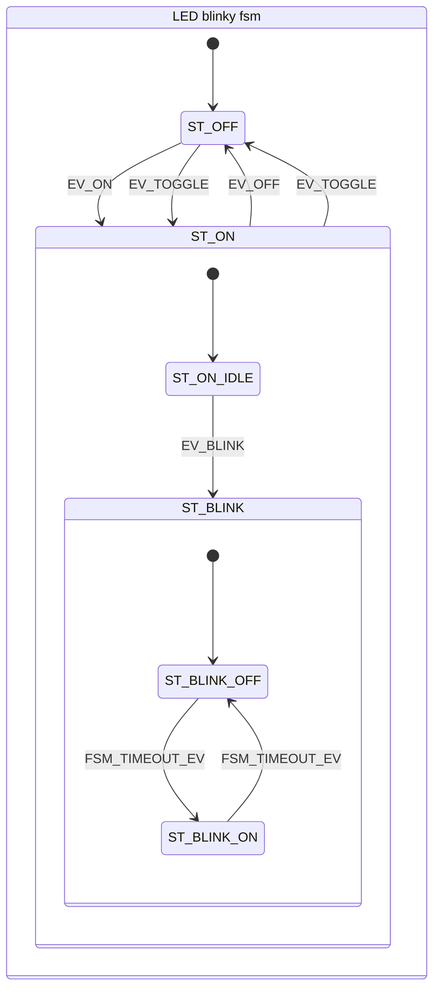

```mermaid
stateDiagram-v2
	state ST_ROOT {
		[*] --> ST_OFF
		ST_OFF
		ST_ON
	}

	state ST_ON {
		[*] --> ST_ON_IDLE
		ST_ON_IDLE
		ST_BLINK
	}

	state ST_BLINK {
		[*] --> ST_BLINK_OFF
		ST_BLINK_OFF
		ST_BLINK_ON
	}

	 ST_OFF --> ST_ON : EV_ON
	 ST_ON --> ST_OFF : EV_OFF
	 ST_OFF --> ST_ON : EV_TOGGLE
	 ST_ON --> ST_OFF : EV_TOGGLE
	 ST_ON_IDLE --> ST_BLINK : EV_BLINK
	 ST_BLINK_ON --> ST_BLINK_OFF : FSM_TIMEOUT_EV
	 ST_BLINK_OFF --> ST_BLINK_ON : FSM_TIMEOUT_EV
	 ST_ROOT : LED blinky fsm
```