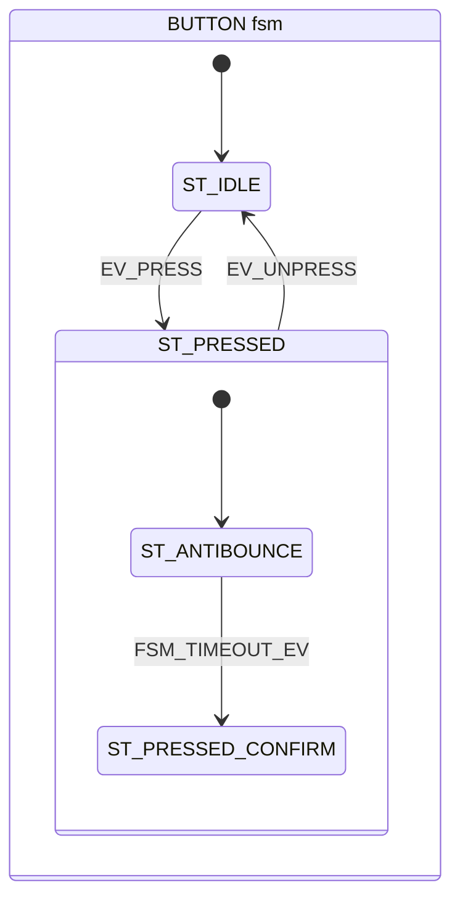

```mermaid
stateDiagram-v2
	state ST_ROOT {
		[*] --> ST_IDLE
		ST_IDLE
		ST_PRESSED
	}

	state ST_PRESSED {
		[*] --> ST_ANTIBOUNCE
		ST_ANTIBOUNCE
		ST_PRESSED_CONFIRM
	}

	 ST_IDLE --> ST_PRESSED : EV_PRESS
	 ST_PRESSED --> ST_IDLE : EV_UNPRESS
	 ST_ANTIBOUNCE --> ST_PRESSED_CONFIRM : FSM_TIMEOUT_EV
	 ST_ROOT : BUTTON fsm
```