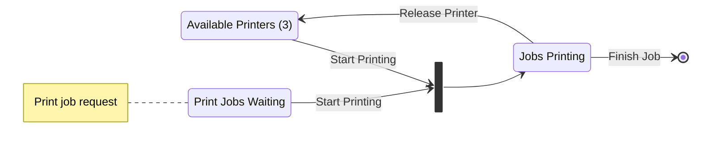

```mermaid
stateDiagram-v2
    direction LR
    
    state "Available Printers (3)" as Printers 
    
    state start_print <<fork>>
    
    state "Print Jobs Waiting" as Queue
    note left of Queue: Print job request
    state "Jobs Printing" as Printing
    
    Printers --> start_print: Start Printing
    Queue --> start_print: Start Printing
    Printing --> [*]: Finish Job
    Printing --> Printers: Release Printer
    
    start_print --> Printing

 
```