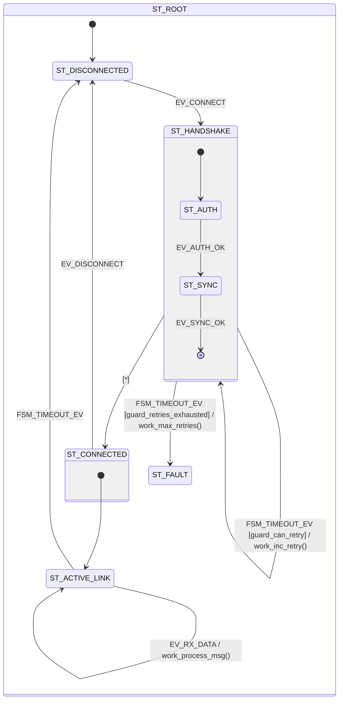

```mermaid
stateDiagram-v2
    state ST_ROOT {
        [*] --> ST_DISCONNECTED
        ST_DISCONNECTED
        state ST_HANDSHAKE {
            [*] --> ST_AUTH
            ST_AUTH
            ST_SYNC
            ST_AUTH --> ST_SYNC : EV_AUTH_OK
            ST_SYNC --> [*] : EV_SYNC_OK
        }
        state ST_CONNECTED {
            [*] --> ST_ACTIVE_LINK
            ST_ACTIVE_LINK
            ST_ACTIVE_LINK --> ST_ACTIVE_LINK : EV_RX_DATA / work_process_msg()
        }
        ST_FAULT
        ST_DISCONNECTED --> ST_HANDSHAKE : EV_CONNECT
        ST_HANDSHAKE --> ST_CONNECTED : [*]
        ST_HANDSHAKE --> ST_HANDSHAKE : FSM_TIMEOUT_EV [guard_can_retry] / work_inc_retry()
        ST_HANDSHAKE --> ST_FAULT : FSM_TIMEOUT_EV [guard_retries_exhausted] / work_max_retries()
        ST_ACTIVE_LINK --> ST_DISCONNECTED : FSM_TIMEOUT_EV
        ST_CONNECTED --> ST_DISCONNECTED : EV_DISCONNECT
    }
```
