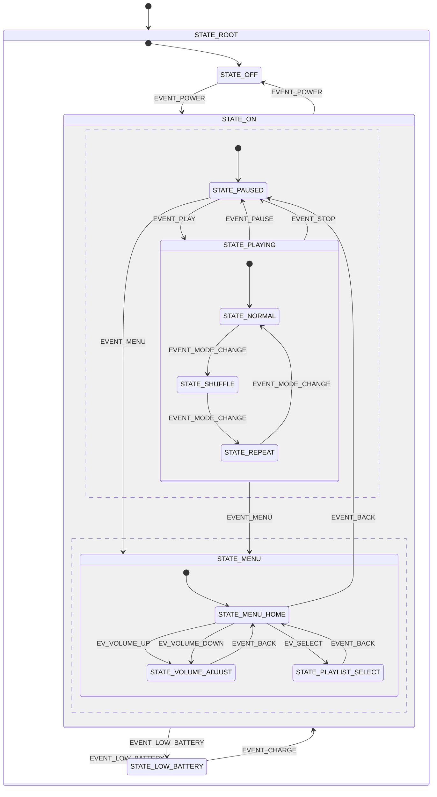

```mermaid
stateDiagram-v2
    [*] --> STATE_ROOT
    state STATE_ROOT {
        [*] --> STATE_OFF
        STATE_OFF
        state STATE_ON {
            [*] --> STATE_PAUSED
            STATE_PAUSED
            state STATE_PLAYING {
                [*] --> STATE_NORMAL
                STATE_NORMAL
                STATE_SHUFFLE
                STATE_REPEAT
            }
            --
            state STATE_MENU {
                [*] --> STATE_MENU_HOME
                STATE_VOLUME_ADJUST --> STATE_MENU_HOME : EVENT_BACK
                STATE_PLAYLIST_SELECT --> STATE_MENU_HOME : EVENT_BACK 
            }
        }
        STATE_LOW_BATTERY
    }

    STATE_OFF --> STATE_ON : EVENT_POWER
    STATE_ON --> STATE_OFF : EVENT_POWER
    STATE_PAUSED --> STATE_PLAYING : EVENT_PLAY
    STATE_PLAYING --> STATE_PAUSED : EVENT_PAUSE
    STATE_PLAYING --> STATE_PAUSED : EVENT_STOP
    STATE_NORMAL --> STATE_SHUFFLE : EVENT_MODE_CHANGE
    STATE_SHUFFLE --> STATE_REPEAT : EVENT_MODE_CHANGE
    STATE_REPEAT --> STATE_NORMAL : EVENT_MODE_CHANGE
    STATE_PAUSED --> STATE_MENU : EVENT_MENU
    STATE_PLAYING --> STATE_MENU : EVENT_MENU
    STATE_MENU_HOME --> STATE_PAUSED : EVENT_BACK
    STATE_MENU_HOME --> STATE_VOLUME_ADJUST : EV_VOLUME_UP
    STATE_MENU_HOME --> STATE_VOLUME_ADJUST : EV_VOLUME_DOWN
    STATE_MENU_HOME --> STATE_PLAYLIST_SELECT : EV_SELECT
    STATE_ROOT --> STATE_LOW_BATTERY : EVENT_LOW_BATTERY
    STATE_ON --> STATE_LOW_BATTERY : EVENT_LOW_BATTERY
    STATE_LOW_BATTERY --> STATE_ON : EVENT_CHARGE
```